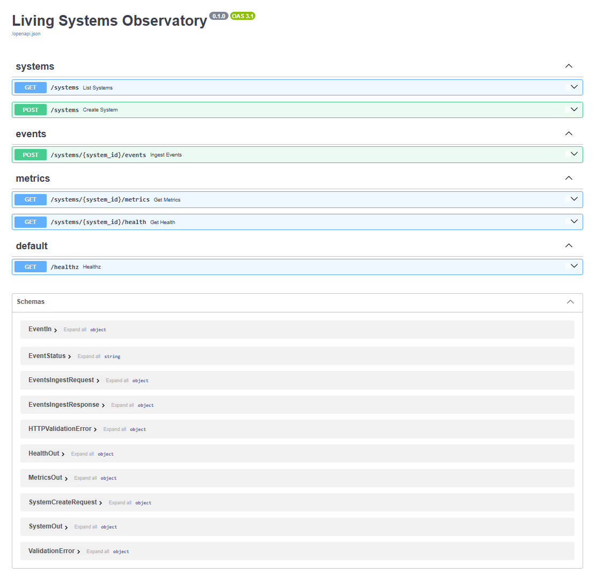

# Living Systems Observatory

A FastAPI telemetry and health service for registering systems, ingesting events, calculating rolling metrics, and exposing health status through a simple API.

## Features

- Register and list monitored systems
- Ingest telemetry events
- Validate requests with Pydantic
- Persist event data in SQLite
- Calculate request rate, error rate, and latency metrics
- Report system health status
- Isolate data by `system_id`
- Interactive Swagger/OpenAPI documentation
- Automated tests for core health and metrics behavior
- GitHub Actions CI with passing tests

## Run It

### Windows

1. Click **Code → Download ZIP**
2. Extract the ZIP
3. Open the folder
4. Double-click **`run.bat`**

The launcher installs any missing dependencies, initializes the database, starts the API, and automatically opens:

`http://127.0.0.1:8000/docs`

> Python must already be installed.

## API

Main endpoints include:

- `GET /systems`
- `POST /systems`
- `POST /systems/{system_id}/events`
- `GET /systems/{system_id}/metrics`
- `GET /systems/{system_id}/health`
- `GET /healthz`

## Built With

- Python
- FastAPI
- Pydantic
- SQLite
- pytest
- Uvicorn
- GitHub Actions

## Purpose

I built LSO as a small observability backend focused on telemetry ingestion, rolling metrics, health classification, persistence, automated testing, and clear API design.
